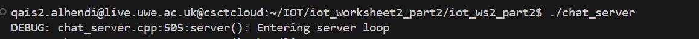
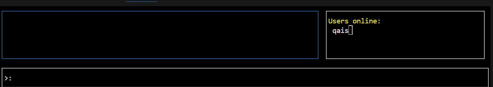
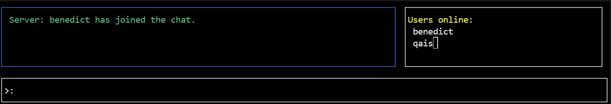
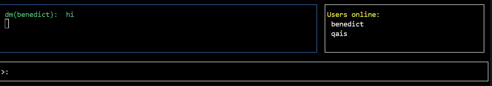
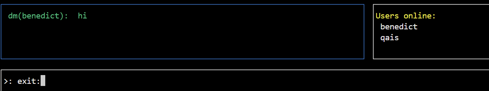
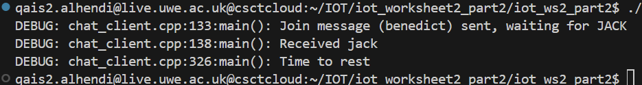
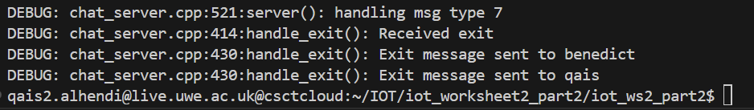
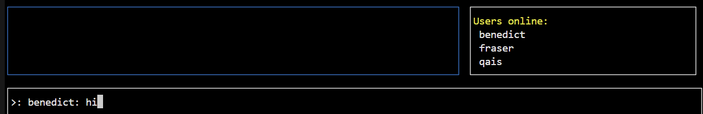
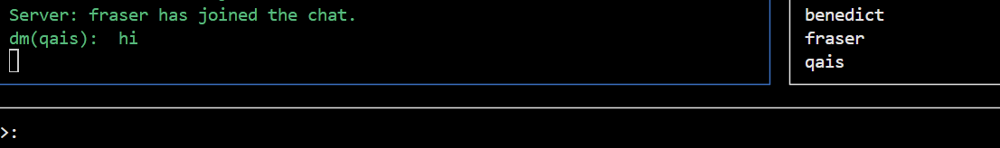
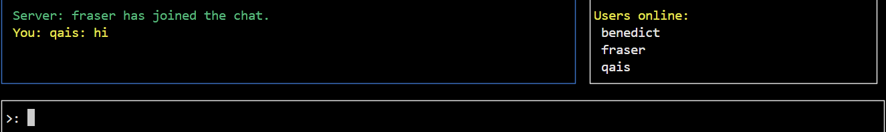

# Worksheet 2 part 2
## Overview
This task involves creating a chat application to handle messages, managing online users and facilitating client communication using a structured approach for message handling.
## Getting started
To get a copy of this project up and running on your local machine, follow these instructions.
## Essentials
* C++ 17 compatible compiler (e.g g++ or clang++)
* Make (for building the project)
* Access to the custom IoT library located at /opt/iot/
## Initisialising the project environment
1. Clone the repository and navigate into the project directory:
~~~bash
https://gitlab.uwe.ac.uk/q2-alhendi/iot_ws2_part2.git
~~~
2. Choose directory:
~~~bash
cd iot_ws2_part2
~~~
3. To compile/build server and client:
~~~bash
make all #to build both server and client
#orr
make
~~~
4. To run the server and client:
~~~bash
./chat_server
./chat_client 192.168.1.99 1020 qais
#assuiming this is the ip address, port number and name of client wanted
~~~
## Task 1 and 2: Implementing Server Functions And chat client
This task involves buildiing three server functions: Join, direct message and exit.
### Elements
* Server receiving messages from client
* Chat application GUI displayed on console
* List of online users
* Public messages (can be seen by all online users)
* Direct messages
* Leave option for users
* exit option to kill the application
### Make
To build the application:
~~~bash
make all
~~~
### The code for each of the 3 functions:
The join function:
~~~bash
void handle_join(
    online_users& users, std::string username, std::string,
    struct sockaddr_in& client_address, uwe::socket& sock, bool& exit_loop) {
    if (users.find(username) != users.end()) {
        handle_error(ERR_USER_ALREADY_ONLINE, client_address, sock, exit_loop);
    } else {
        auto* addr = new sockaddr_in(client_address);
        users[username] = addr;
        auto msg = chat::jack_msg();
        sock.sendto(reinterpret_cast<const char*>(&msg), sizeof(msg), 0, (sockaddr*)&client_address, sizeof(client_address));
        for (const auto& user : users) {
            if (user.first != username) {
                auto brdcst = chat::broadcast_msg("Server", username + " has joined the chat.");
                sock.sendto(reinterpret_cast<const char*>(&brdcst), sizeof(brdcst), 0, (sockaddr*)user.second, sizeof(sockaddr_in));
            }
        }
        handle_list(users, USER_ALL, "", client_address, sock, exit_loop);
    }
~~~
The direct message function:
~~~bash
void handle_directmessage(
    online_users& online_users, std::string recipient, std::string message,
    struct sockaddr_in& client_address, uwe::socket& sock, bool& exit_loop) {
    DEBUG("Received direct message to %s\n", recipient.c_str());

    // Find the recipient in the map of online users
    auto recipient_it = online_users.find(recipient);
    if (recipient_it != online_users.end()) {
        DEBUG("Found user for direct message\n");
        // Create the direct message
        auto d = chat::dm_msg(recipient, message);
        // Send the direct message
        int len = sock.sendto(
            reinterpret_cast<const char*>(&d), sizeof(chat::chat_message), 0,
            (sockaddr*)recipient_it->second, sizeof(struct sockaddr_in));

        if (len < 0) {
            DEBUG("Failed to send direct message to %s\n", recipient.c_str());
            // Optionally handle the send error (e.g., by logging or retrying)
        }
    } else {
        DEBUG("Recipient %s not found\n", recipient.c_str());
        // Optionally handle the case when the recipient is not found
    }
~~~
The exit function:
~~~bash
void handle_exit(
    online_users& online_users, std::string username, std::string, 
    struct sockaddr_in& client_address, uwe::socket& sock, bool& exit_loop) {
    
    DEBUG("Received exit\n");

    // Iterate over the online_users map to send an exit message to each user
    for (auto& user_entry : online_users) {
        std::string user_name = user_entry.first;
        sockaddr_in* user_addr = user_entry.second;

        // Create the exit message packet
        chat::chat_message exit_message = chat::exit_msg();

        // Send the exit message to the user
        int len = sock.sendto(
            reinterpret_cast<const char*>(&exit_message), sizeof(chat::chat_message), 0,
            (sockaddr*)user_addr, sizeof(struct sockaddr_in));

        if (len == sizeof(chat::chat_message)) {
            DEBUG("Exit message sent to %s\n", user_name.c_str());
        } else {
            DEBUG("Failed to send exit message to %s\n", user_name.c_str());
            // Handle the failure to send the message (e.g., error message or other actions)
        }
        // Clear up memory for the user
        delete user_addr;
    }
    // Clear the online_users map
    online_users.clear();
    // Set exit_loop to true to indicate that the event loop should terminate
    exit_loop = true;
~~~
### Output
Debug message indicating server is running successfully:

GUI displayed when the client runs:

Another user added and message displayed on GUI:

Direct message sent by this format(username: message)

Typing exit:

Results after sending it for both users:

Server's terminal:

Having 3 users and sending a dm
message from qais to benedict:

Message not received by Fraser:

## Task 3: Enhancing the chat application to support user groups
This task involves implementing serveral new functions to the server.

### Elements
* Creating a header file
* Make group function
* Add members function
* Leave group function

